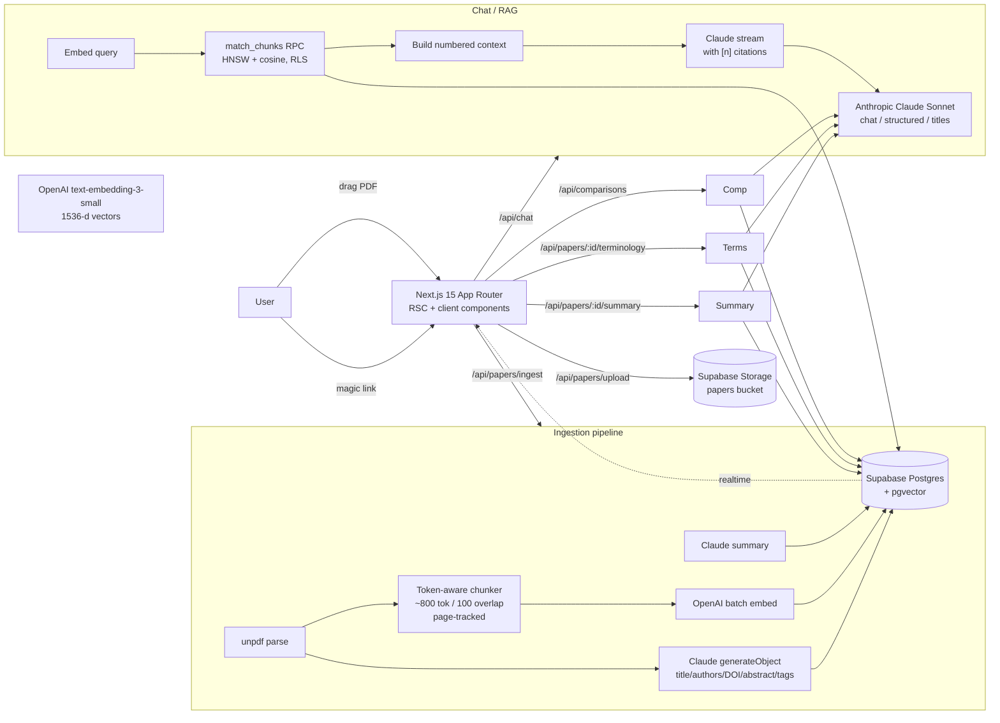
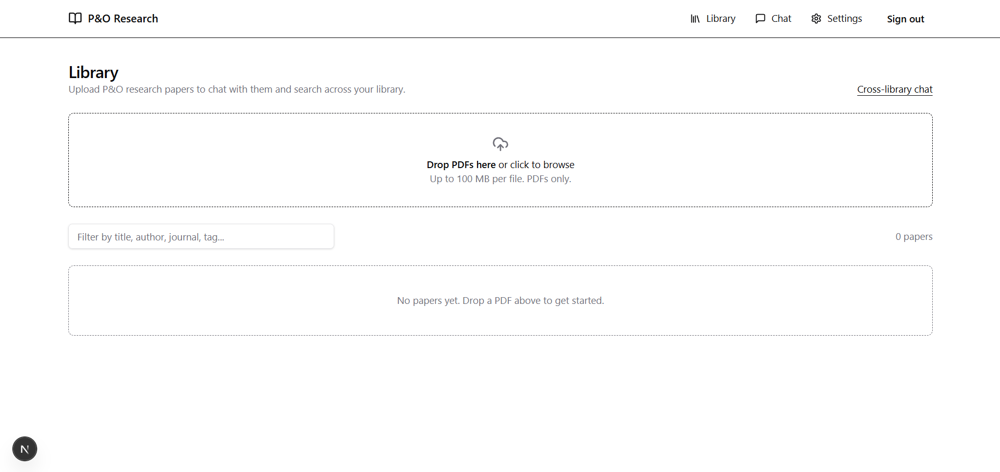
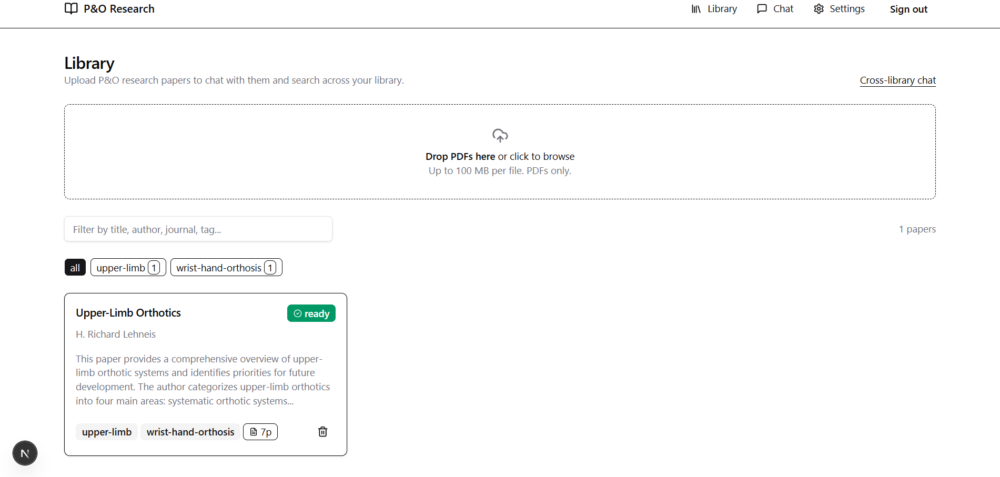
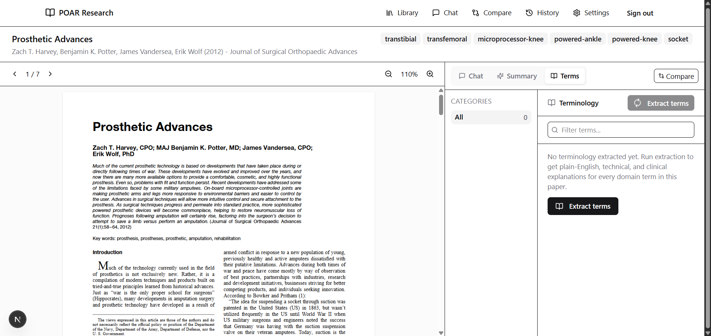
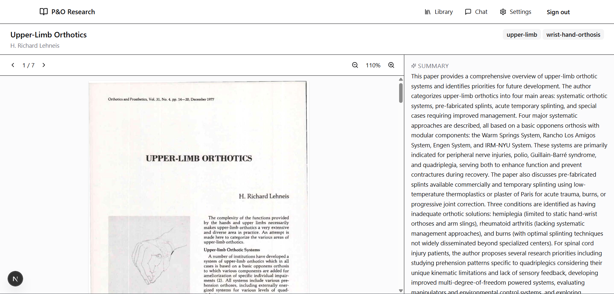
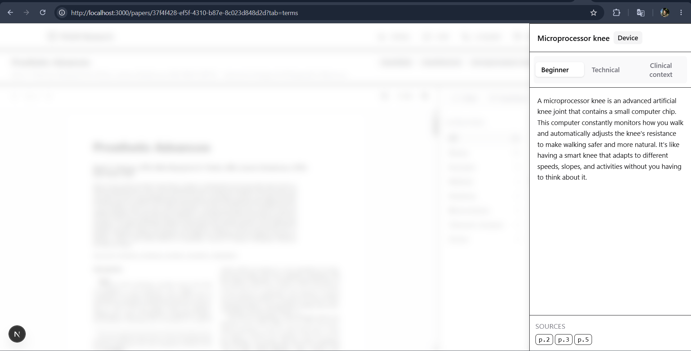
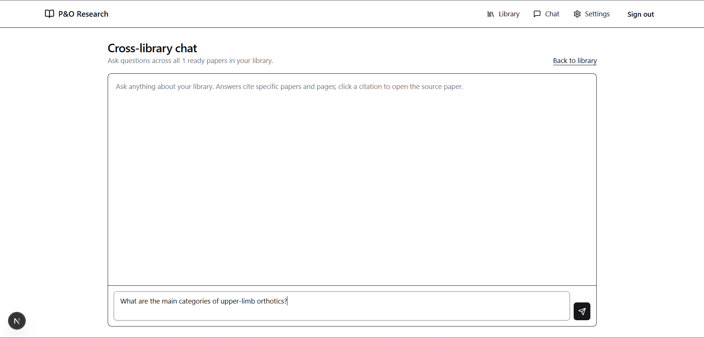
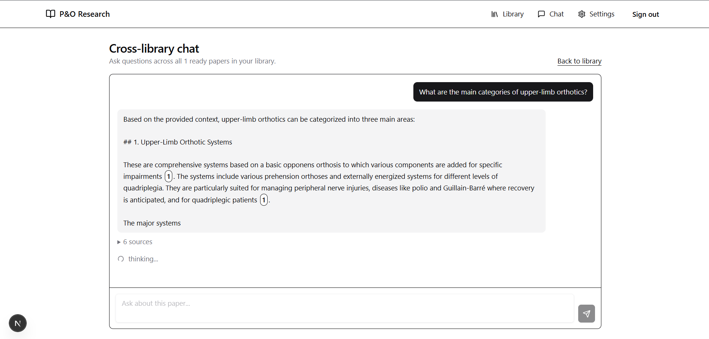

# POAR Research Assistant

> AI research assistant for prosthetics, orthotics, biomechanics, and rehabilitation robotics papers.

[](https://github.com/advien/poar-research-assistant/actions/workflows/ci.yml)
[](https://nextjs.org)
[](https://www.typescriptlang.org)
[](https://supabase.com)
[](https://www.anthropic.com)
[](https://openai.com)
[](https://sdk.vercel.ai)
[](https://tailwindcss.com)
[](LICENSE)

---

## Project Overview

**POAR** stands for **Prosthetics, Orthotics, and Assistive Robotics**. POAR
Research Assistant is an AI-powered biomedical research workspace built for
clinicians, biomedical engineering students, and researchers reading literature
in the prosthetics / orthotics / biomechanics / rehabilitation robotics space.

Drop a PDF in, the app:

- extracts metadata, embeds the full text, writes a Claude summary;
- lets you chat with one paper or your whole library, with every claim cited
  back to a specific page;
- generates structured, sectioned summaries with retry / regenerate / version
  history;
- extracts domain terminology with three explanation depths (beginner,
  technical, clinical context);
- compares any two papers side by side with a similarity score, contradiction
  detection, and a "which paper is methodologically stronger" verdict.

Designed and shipped as a portfolio project, but production-shaped:
end-to-end RLS, keyset pagination, structured outputs with citation
resolution, mobile responsive, deployable to Cloudflare.

---

## Features

| Feature | What it does |
| --- | --- |
| **Library** | Drag-drop PDF upload (signed Supabase Storage URLs), live status badges, paper grid, multi-tag filters grouped by domain category. |
| **Ingestion** | `unpdf` text extraction -> Claude metadata (title / authors / DOI / abstract / tags) -> token-aware chunking with page tracking -> OpenAI embeddings -> Claude summary. Status pushed via Supabase Realtime. |
| **Per-paper chat** | Streaming Claude answers with inline `[n]` citations, click a citation to jump to that PDF page. Conversations persist with auto-generated titles. |
| **Cross-library chat** | Same RAG pipeline, no `paper_id` filter. Citation badges link to the source paper. |
| **Conversation sidebar** | Pin / archive / rename / delete, time grouping (Today / Yesterday / Previous 7 days / Older), debounced search across titles and message contents, keyset pagination, mobile drawer, `Ctrl+K` to search, `Ctrl+Shift+O` for new chat. |
| **Structured Summary** | Seven sections (Abstract / Methods / Findings / Limitations / Clinical Relevance / POAR Relevance / Future Directions), every section cites supporting chunks, version history, regenerate. |
| **Terminology Explain Mode** | 15-30 extracted terms grouped by category, three explanation levels (beginner / technical / clinical context), pronunciation hints, full-text filter, click-card detail drawer. |
| **Compare Papers** | Picker page, generates an 8-section side-by-side comparison + contradiction list + similarity score (0-1) + stronger-paper verdict. Citations are prefixed `A p.4` / `B p.7` and link to the source paper. |
| **History** | Unified history page with tabs for Summaries / Terminology / Comparisons, search across titles and contents, pin / archive / delete. |
| **Settings** | Per-feature counters, model identifiers, env-var health checks, full categorized POAR tag vocabulary view. |

---

## Tech Stack

- **Frontend**: Next.js 15 (App Router, RSC, route handlers), TypeScript, Tailwind CSS 4, shadcn-style primitives, `react-pdf` viewer, lucide icons.
- **Backend**: Supabase Postgres + `pgvector`, Supabase Auth (email magic link), Supabase Storage (private bucket).
- **AI**: Anthropic Claude Sonnet via [Vercel AI SDK](https://sdk.vercel.ai) (`@ai-sdk/anthropic`) for chat, structured outputs (`generateObject` + Zod), summaries, comparisons; OpenAI `text-embedding-3-small` (1536-d) for embeddings.
- **PDF**: `unpdf` (text extraction in serverless), `react-pdf` + `pdfjs-dist` (in-browser viewer).
- **Hosting**: Cloudflare Pages / Workers via `@opennextjs/cloudflare`.

---

## Architecture



### Project layout

```
src/
  app/
    layout.tsx, page.tsx           shell + auth-aware nav, root redirect
    login/                         magic-link form (Suspense-wrapped)
    auth/{callback,signout}/       OAuth/OTP exchange + sign-out POST
    library/                       paper grid, upload, categorized tag filter
    papers/[id]/                   tabs: Chat / Summary / Terms; PDF viewer left
    chat/, chat/[id]/              cross-library workspace + sidebar
    compare/, compare/[id]/        picker + side-by-side comparison view
    history/                       unified analyses history
    settings/                      counters, env health, vocabulary
    api/
      papers/                      list, upload, ingest, [id] CRUD
      papers/[id]/summary          generate / get latest + version list
      papers/[id]/terminology      generate / get latest + version list
      summaries/[id]               GET / PATCH / DELETE
      terminology/[id]             GET / PATCH / DELETE
      comparisons[/[id]]           list / generate, GET / PATCH / DELETE
      analyses                     unified history (rank-fused FTS)
      chat                         streaming RAG endpoint
      chats[/[id][/title]]         conversation CRUD, title regen
      search                       hybrid vector + tsvector search
    error.tsx, not-found.tsx, loading.tsx, global-error.tsx
  lib/
    supabase/{client,server,admin}.ts
    ai/{anthropic,openai,prompts,title}.ts
    ingest/                        parse / chunk / embed / metadata / summary / orchestrator
    analyses/                      paperContext, prompts, schemas, generators, resolve
    chats/                         keyset cursor helpers
    tags.ts                        typed categorized POAR vocabulary + normaliser
    utils.ts, env.ts
  components/
    ui/                            button, input, card, badge, textarea, tabs,
                                   collapsible, drawer, skeleton
    chat/                          ConversationSidebar, ConversationItem,
                                   useConversations, ChatWorkspaceLayout, timeGroups
    analyses/                      CitationBadges
  types/db.ts                      hand-written DB schema
middleware.ts                      auth gate
supabase/migrations/               0001 init -> 0005 analyses
docs/DEPLOYMENT.md                 Cloudflare Pages walkthrough
wrangler.toml, open-next.config.ts Cloudflare config
```

---

## AI / RAG Pipeline

### 1. PDF ingestion
- Browser PUTs the file directly to Supabase Storage with a one-shot signed URL.
- Server route fetches it back, runs `unpdf` for per-page text extraction, normalises hyphenated line breaks, and produces a clean per-page text array.

### 2. Metadata extraction
- The first ~3 pages plus the categorized tag vocabulary are sent to Claude via the AI SDK's `generateObject`, constrained by a Zod schema (`title`, `authors[]`, `journal`, `year`, `doi`, `abstract`, `tags[]`).
- Returned tags pass through `dedupeAndNormalizeTags` which maps acronyms (`BCI` -> `brain-computer-interface`, `FES` -> `functional-electrical-stimulation`, etc.) and rejects anything outside the controlled vocabulary.

### 3. Chunking
- Paragraph-aware, ~800 token chunks with 100-token overlap, never crossing more than two pages.
- Cheap regex section detection labels chunks as `abstract` / `methods` / `results` / `discussion`.
- Each chunk records `page_start`, `page_end`, `section`, `tokens`.

### 4. Embeddings
- OpenAI `text-embedding-3-small` (1536-d), batched up to 96 inputs per call.
- Stored in `chunks.embedding vector(1536)` with an HNSW cosine index.

### 5. Summary
- Claude writes a ~250-word technical prose summary covering aim / population / methods / results / clinical implications.

### 6. Retrieval (chat)
- Query string is embedded with the same OpenAI model.
- `match_chunks(query_embedding, k, filter_paper_id?)` is a Postgres function that runs under RLS (`security invoker`), returns top-k by cosine similarity, and supports an optional paper filter for per-paper chats.

### 7. Generation (chat)
- Top-k chunks are wrapped in a numbered context block (`[1] (paper id, p.4) ...`).
- The system prompt instructs Claude to cite as `[n]` and refuse claims that are not in context.
- The response streams via `createDataStreamResponse`; a `data` annotation carries the resolved `Citation[]` so the UI can render clickable badges *as the answer streams*.
- After the stream finishes, both turns are persisted, and on the first turn Claude generates a 4-8 word chat title that surfaces back into the sidebar.

### 8. Structured analyses (Summary / Terminology / Comparison)
- The same chunk store powers them. `loadPaperContext()` builds a numbered context block (`[A3]`, `[B7]` for comparisons) and a 1-indexed `Citation[]` registry.
- Each generator calls `generateObject` against a Zod schema that requires `citations: number[]` (or `string[]` like `"A3"`) per cited field.
- After generation, citation references are resolved into real `Citation` objects, the payload + registry are stored, and the UI re-resolves on read so links keep working forever.
- Outputs are versioned (`version int` per `(user_id, paper_id)` or `(user_id, paper_a_id, paper_b_id)`), so regenerate creates a new row and old versions remain reachable from the in-tab Versions list.

### 9. Hybrid search
- `hybrid_search(query_text, query_embedding, k)` uses Reciprocal Rank Fusion across vector similarity and `tsvector` full-text rankings, deduped per `(paper_id, page)` window.

### 10. Realtime
- The papers table is added to the `supabase_realtime` publication. The library page subscribes and updates ingestion status badges live (`pending -> parsing -> embedding -> ready`) with no polling.

---

## Screenshots

| | |
| --- | --- |
| Drop PDF |  |
| Library + tag filter |  |
| Paper view: PDF |  |
| Structured Summary tab |  |
| Terminology Explain Mode |  |
| Chat with inline citations |   |
| Compare Papers side-by-side | see [live demo](https://research.advien.tech) |

> A walkthrough demo GIF / video of the chat + citations + paper view will
> be linked here once recorded. The ingestion → ready timeline is best seen
> in motion.

---

## Reliability Design

POAR is opinionated about being a reliable AI workflow rather than a fancy
chatbot. Concretely:

- **Grounded generation only.** The chat system prompt forbids fabrication
  and requires every claim to cite a numbered context chunk. When retrieval
  returns zero rows the prompt receives a documented `(no relevant chunks
  were retrieved from the user's library)` placeholder so the model can
  refuse cleanly instead of hallucinating.
  See [`src/lib/rag/retrieve.ts`](src/lib/rag/retrieve.ts) and
  [`src/lib/ai/prompts.ts`](src/lib/ai/prompts.ts).
- **1-indexed Citation registry.** Every cited claim resolves to a real
  `Citation { chunk_id, paper_id, page_start, page_end, snippet }` *on the
  server*; hallucinated citation numbers are silently dropped (see
  [`resolveCitationRefs`](src/lib/analyses/paperContext.ts)). Links keep
  working forever because the registry is stored alongside the payload, not
  derived at render time.
- **Structured outputs are schema-enforced.** Summary, terminology, and
  comparison generators use the AI SDK's `generateObject` with a Zod schema
  ([`src/lib/analyses/schemas.ts`](src/lib/analyses/schemas.ts)). The model
  cannot emit an unparseable response; if it tries, we capture the failure
  with `NoObjectGeneratedError` and surface a typed error.
- **Per-stage status with retries.** Ingestion is split into discrete stages
  (`pending → parsing → embedding → summarizing → ready` with `retrying` and
  `failed` siblings). Transient errors (timeouts, rate-limits, internal)
  are retried with exponential backoff; non-transient failures (scanned
  PDFs, validation errors) surface immediately. See
  [`docs/engineering/ingestion.md`](docs/engineering/ingestion.md).
- **Rate-limited AI endpoints.** All five AI-touching routes (chat, ingest,
  upload, summary, terminology, comparison) are rate-limited per user / IP
  with configurable per-scope buckets. Exceeding the limit returns a 429
  with `Retry-After`; the chat UI renders a calm "rate limit reached" banner
  instead of blowing up the conversation.
- **RLS at every layer.** Embeddings, papers, chats, summaries, terminology,
  and comparisons all live behind row-level security. The retrieval RPC
  filters by `auth.uid()` in the same query as the ANN, so a forgotten
  `WHERE` clause cannot leak data.

The full design rationale lives in
[`docs/engineering/decisions.md`](docs/engineering/decisions.md).

---

## Observability

Every AI call emits a structured JSON log line via
[`src/lib/observability/logger.ts`](src/lib/observability/logger.ts):

```json
{
  "ts": "2026-05-19T12:00:00.000Z",
  "level": "info",
  "msg": "rag.retrieve.done",
  "request_id": "0e7c1b1a-...",
  "user_id": "8a82b7e3-...",
  "route": "/api/chat",
  "chat_id": "...",
  "retrieved_chunks": 8,
  "retrieved_chunk_ids": ["...", "..."],
  "empty": false,
  "latency_ms": 842
}
```

Routes share a request-scoped logger (`createRequestLogger({ route, userId })`)
that auto-stamps `request_id`. Per-stage events follow a stable
`<feature>.<stage>.<verb>` naming convention (`rag.retrieve.start`,
`chat.generation.done`, `ingest.embed.done`). Errors are bucketed via
`classifyError()` into a small, stable set of `error_type` values
(`auth | rate_limit | timeout | ingest_no_text | embedding | model |
validation | internal | unknown`) so dashboards filter by failure mode
without pattern-matching free text.

Cloudflare Logpush / Vercel Logs / Datadog all index these out of the box.
Sample queries (slowest chats, empty-retrieval rate, token usage by model
per day) are listed in [`docs/engineering/observability.md`](docs/engineering/observability.md).

### RAG Trace Store

Every completed chat request writes one row to the `rag_traces` Supabase
table via [`src/lib/observability/trace.ts`](src/lib/observability/trace.ts).
The write is fire-and-forget inside `onFinish` — it never blocks the
streaming response.

| Column | What it captures |
| --- | --- |
| `retrieval_latency_ms` | Time from embed-query call to RPC return |
| `retrieval_chunk_count` | Number of chunks returned by `match_chunks` |
| `retrieval_top_score` | Highest cosine similarity in the result set (0–1) |
| `retrieval_empty` | True when the RPC returned zero rows |
| `generation_latency_ms` | Time from `streamText` start to `onFinish` |
| `total_latency_ms` | End-to-end wall time for the full request |
| `input_tokens` / `output_tokens` | Token usage from the Anthropic response |
| `finish_reason` | `stop` / `length` / `error` from the model |
| `eval_faithfulness` | DeepEval score (populated by the eval pipeline) |
| `eval_answer_relevancy` | DeepEval score (populated by the eval pipeline) |

Rows are protected by RLS — users can read only their own traces; the eval
pipeline uses the service-role key to write scores back.

---

## Evaluation

The project has two complementary eval tools:

### 1. Pre-deploy regression harness (`evals/run.ts`)

A Node CLI that fires real HTTP requests at a live deployment and verifies
the end-to-end RAG pipeline against a labelled dataset.

- **`evals/rag-eval.json`** — eight POAR-domain probes: dataset, amputation
  level, device, outcomes, limitations, control strategy, and two
  out-of-corpus refusal probes.
- **`evals/run.ts`** — POSTs each question through `/api/chat`, reads the
  streamed response (text + citation annotations), and reports retrieval hit
  rate, citation coverage, answer-match rate, refusal correctness, and
  p50/p95/max latency.

```bash
POAR_API_URL=http://localhost:3000 \
POAR_AUTH_COOKIE='sb-access-token=...; sb-refresh-token=...' \
npm run eval:rag
```

Returns a non-zero exit code when retrieval hit rate drops below 70% or
refusal accuracy drops below 80%, making it suitable to gate deploys on.

### 2. Production quality monitor (`evals/run.py`)

A Python script that reads production traces from `rag_traces` and scores
them with [DeepEval](https://github.com/confident-ai/deepeval) — no live
traffic required.

- **Faithfulness** — does the answer stay within the retrieved context?
- **Answer Relevancy** — does the answer address the user's question?
- **Refusal detection** — port of `metrics.ts` `detectRefusal`; refusals are
  scored 0.0 directly without an LLM judge call (saves cost).

Scores are written back to `eval_faithfulness` / `eval_answer_relevancy` in
`rag_traces` incrementally — a crash mid-batch does not lose earlier results.

```bash
pip install -r evals/requirements.txt
python evals/run.py          # scores up to 50 unscored rows, prints a report
```

A GitHub Actions workflow ([`.github/workflows/weekly-eval.yml`](.github/workflows/weekly-eval.yml))
runs this automatically every Monday at 09:00 UTC, and can be triggered
manually from the Actions tab via `workflow_dispatch`.

Full design and adding-new-probes guide:
[`docs/engineering/evaluation.md`](docs/engineering/evaluation.md).

---

## Error Handling

| Layer | Strategy |
| --- | --- |
| **Request validation** | Centralised Zod schemas in [`src/lib/api/schemas.ts`](src/lib/api/schemas.ts) plus a `safeParse` helper that returns a discriminated union. Malformed JSON, missing fields, oversize content, non-UUID ids, and unknown roles all reject with a `400 bad_request`. |
| **Auth** | Every route checks `supabase.auth.getUser()` first and returns `401 unauthorized` if no session. RLS provides defence-in-depth. |
| **Rate limiting** | `enforceRateLimit({ req, scope, userId })` returns `null` when allowed and a ready 429 `Response` (with `Retry-After` + `X-RateLimit-*` headers) when blocked. The chat UI parses the 429 body and renders a friendly banner. |
| **Retrieval failure** | `retrieveContext` throws on RPC errors with a clear "retrieval failed: <pgcode>" message; the route logs `rag.retrieve.failed` and returns 500. Empty top-k is **not** an error: it falls back to a documented placeholder so the model can refuse cleanly. |
| **Generation failure** | Streaming routes use `createDataStreamResponse({ onError })`. The error is classified, logged, and surfaced to the client as a plain string the UI shows in a destructive banner. Non-streaming routes return `500 generation_failed` with a classified `detail`. |
| **Ingestion failure** | Per-stage status writes mean we always know which stage failed. Transient failures retry with exponential backoff up to `maxAttempts`; non-transient failures stop immediately and write `papers.status = 'failed'` with the classified message. |
| **Structured-output schema rejection** | The AI SDK throws `NoObjectGeneratedError`. We capture and log `cause`, `finishReason`, `usage`, and a 800-char text snippet so the next prompt-tuning iteration starts with real evidence. |

---

## Loading States

Each long-running step in the app surfaces a typed loading state in the UI
so the user always knows where they are in the workflow.

| Step | UI surface | Copy |
| --- | --- | --- |
| Upload (browser → Storage) | dropzone row | "uploading" with spinner |
| Ingestion: queued | library card status badge | `Queued` (amber) |
| Ingestion: parsing PDF | library card status badge | `Parsing PDF…` (amber) |
| Ingestion: embedding chunks | library card status badge | `Generating embeddings…` (amber) |
| Ingestion: writing summary | library card status badge | `Writing summary…` (amber) |
| Ingestion: retrying transient failure | library card status badge | `Retrying…` (amber) |
| Ingestion: ready | library card status badge | `Ready` (green) |
| Ingestion: failed | library card status badge | `Failed` (red) + error text |
| Retrieval (RAG) | chat panel composer | `thinking…` spinner |
| Generation (LLM streaming) | chat panel composer | `thinking…` spinner; the Send button swaps to a red Stop button while streaming so the user can cancel |
| Grounding outcome | per-assistant message | green `Grounded in N sources` / amber `No supporting context found` / amber `Sources retrieved but not referenced` |
| Rate limit reached | chat panel | amber banner with `Retry-After` countdown |
| Generation error | chat panel | destructive banner with the classified error message |

Status copy lives in `STATUS_COPY` (library) and `INGEST_STATUS_LABEL`
(paper page). The DB stores the raw enum (`pending` / `parsing` /
`embedding` / `summarizing` / `retrying` / `ready` / `failed`); the UI maps
to user-facing copy at the boundary.

---

## Known Limitations

What this codebase deliberately does NOT do today:

- **OCR for scanned PDFs.** Documents with no extractable text are rejected
  during ingestion with a clear "no extractable text" error. A Claude Vision
  fallback is on the roadmap.
- **Inline ingestion vs a real queue.** `enqueueIngest()` runs the pipeline
  in-process with bounded retries. Cloudflare Workers Free's 30-second CPU
  cap can truncate very long papers; production needs Workers Paid (5 min
  cap) or a swap-in to Cloudflare Queues / Inngest. The state machine and
  retry policy are queue-ready, only the transport changes.
- **Distributed rate limiting.** The per-isolate in-memory limiter is a
  best-effort soft barrier per Worker, not a globally consistent limit. At
  meaningful traffic the `RateLimiter` interface needs a Redis / KV /
  Durable Objects backend.
- **No reranker.** Retrieval relies on pure HNSW cosine for chat (top-k is
  hardcoded at 8 / 12) and RRF hybrid for the dedicated search endpoint.
  Adding a cross-encoder reranker is the natural next quality step.
- **No multi-paper synthesis.** Cross-library chat issues a single ANN
  query; there is no map-reduce stage that summarises across papers before
  answering.
- **Realtime is per-user, not per-team.** RLS factoring is multi-tenant
  ready, but `supabase_realtime` channels are scoped per user.
- **No PR preview deploys configured in this repo.** Cloudflare Pages can
  do them when enabled at the project level; the GitHub Actions CI runs
  on PRs but does not produce a preview URL.
- **No cost / usage caps per user.** Token usage is logged but not
  rate-shaped beyond the per-minute request caps; per-day spend caps are
  out of scope for the MVP.
- **No automated UI tests.** The 100+ unit tests cover lib code and pure
  helpers; React component rendering and end-to-end browser flows are
  exercised manually.
- **PDFs are bounded at 25 MB / 200 pages by default.** Both are env-tunable
  (`UPLOAD_MAX_BYTES`, `INGEST_MAX_PAGES`).
- **Citations link to a PDF page, not a paragraph anchor.** Highlighting
  the cited paragraph inside the PDF viewer is on the roadmap.
- **The eval harness needs real credentials.** `npm run eval:rag` hits a
  live deployment; it does not run inside GitHub Actions CI.

---

## Failure Modes & Mitigations

| Failure | Detection | Mitigation |
| --- | --- | --- |
| Scanned PDF (no extractable text) | `pages.every(p => !p.text.trim())` | Hard-fail to `papers.status = 'failed'`. No retry. Documented OCR fallback in roadmap. |
| Anthropic / OpenAI rate limit | Upstream 429 | Classified as `rate_limit`; ingestion retries with backoff. Chat surfaces a 429 banner to the user. |
| Anthropic 5xx / timeout | Upstream HTTP / SDK error | Classified as `timeout` or `model`; transient classes retry. |
| Cloudflare Workers Free CPU cap (30 s) | Workers kills the isolate | Documented in [`docs/deployment/cloudflare-pages.md`](docs/deployment/cloudflare-pages.md). Mitigation: deploy on Workers Paid (5 min cap) or migrate to a queue (one-line swap of `enqueueIngest`). |
| Empty retrieval / wrong paper | `retrieved_chunks === 0` | Prompt receives the `EMPTY_RETRIEVAL_FALLBACK` placeholder; the model is steered to refuse cleanly. The eval harness asserts refusal correctness >= 80%. |
| Hallucinated citation numbers | `resolveCitationRefs` validates against the registry | Out-of-range numbers are silently dropped. The UI never renders a broken link. |
| Worker isolate killed mid-ingest | (passive) `papers.status` stays in `parsing` / `embedding` / `summarizing` | The 0006 migration adds a partial index on non-terminal statuses so a future watchdog can reset stale rows. |
| Concurrent ingestion of the same paper | Unique `(paper_id, chunk_index)` constraint on `chunks` | Second insert fails; pipeline catches the insert error and moves to `failed`. |
| Token budget exceeded for structured generation | `NoObjectGeneratedError` with `finishReason: 'length'` | We capture and log; user can regenerate (the route allocates 8k–16k output tokens depending on schema size). |
| Streaming response disconnected mid-flight | Browser `aborted` | The `useChat` hook drops the partial assistant turn; the persisted user turn remains. Re-sending replays cleanly. |

---

## CI/CD

[](https://github.com/advien/poar-research-assistant/actions/workflows/ci.yml)

GitHub Actions runs on every push to `main` and every pull request:

- `npm ci` — clean install pinned to the lockfile.
- `npm run lint` — ESLint via `next lint`.
- `npm run typecheck` — `tsc --noEmit`.
- `npm run test` — Vitest, ~100 tests covering chunking, retrieval,
  prompt construction, citation resolution, API validation, rate-limiting,
  observability, and eval metrics.
- `npm run build` — full Next.js production build.
- A separate `coverage` job uploads the v8 LCOV report as an artifact for
  review.

Tests run **offline**: every test injects a fake Supabase / fake embedder /
fake AI SDK call. Real Anthropic, OpenAI, and Supabase credentials are
never exposed to GitHub Actions.

```bash
npm run check  # lint + typecheck + tests, the same gate the CI runs
```

The full pipeline lives in [`.github/workflows/ci.yml`](.github/workflows/ci.yml).

A separate **weekly eval workflow** ([`.github/workflows/weekly-eval.yml`](.github/workflows/weekly-eval.yml))
runs `evals/run.py` every Monday against production `rag_traces`, scores
unscored rows with DeepEval (faithfulness + answer relevancy), and writes
results back to Supabase. Triggerable manually via `workflow_dispatch`.

---

## Local Development

```bash
# 1. Install
npm install

# 2. Configure env
cp .env.example .env.local        # then fill in the five required keys

# 3. Stand up Supabase (or link a hosted project)
supabase link --project-ref <ref>
supabase db push                  # applies migrations 0001 -> 0005

# 4. Run
npm run dev                       # http://localhost:3000
```

### Useful scripts

```bash
npm run dev          # Next.js dev server
npm run build        # production build
npm run start        # serve the production build
npm run lint         # next lint
npm run typecheck    # tsc --noEmit
npm run test         # Vitest, run once
npm run test:watch   # Vitest, interactive watcher
npm run test:coverage # Vitest + v8 coverage (text + html + lcov)
npm run check        # lint + typecheck + tests, the same gate the CI runs
npm run eval:rag     # POST eval probes through /api/chat, report metrics

npm run db:push      # apply local migrations to the linked Supabase project
npm run db:reset     # wipe + replay (local only)
npm run db:types     # regenerate src/types/db.ts from a linked project

npm run cf:build     # build a Cloudflare Worker bundle via @opennextjs/cloudflare
npm run cf:preview   # serve the worker locally via Wrangler
npm run cf:deploy    # deploy to Cloudflare
```

---

## Environment Variables

See [.env.example](.env.example) for the canonical template. Five vars are
required:

| Variable | Public? | Purpose |
| --- | --- | --- |
| `NEXT_PUBLIC_SUPABASE_URL` | yes | Supabase project URL |
| `NEXT_PUBLIC_SUPABASE_ANON_KEY` | yes | Browser auth + anon-RLS reads |
| `SUPABASE_SERVICE_ROLE_KEY` | **no - server-only** | Ingestion pipeline (bypasses RLS for chunk writes) |
| `ANTHROPIC_API_KEY` | **no** | Claude chat / structured outputs / titles |
| `OPENAI_API_KEY` | **no** | Embeddings (`text-embedding-3-small`) |
| `NEXT_PUBLIC_APP_URL` | yes | `http://localhost:3000` locally, `https://research.advien.tech` in prod |

---

## Supabase Setup

1. Create a Supabase project. Save the database password.
2. **Project Settings -> API**: copy URL, anon key, service-role key.
3. **Database -> Extensions**: confirm `vector` is enabled (auto-enabled by `0001_init.sql`).
4. **Authentication -> URL Configuration**:
   - **Site URL**: `http://localhost:3000` for dev, `https://research.advien.tech` for prod
   - **Additional Redirect URLs**: include `http://localhost:3000/auth/callback` and the production callback
5. Push migrations:

```bash
supabase link --project-ref <ref>
supabase db push
```

Or paste each `supabase/migrations/000X_*.sql` file into the SQL Editor in
order.

### Migrations

| File | Purpose |
| --- | --- |
| `0001_init.sql` | extensions, papers / chunks / chats / messages tables, RLS, `match_chunks` and `hybrid_search` RPCs |
| `0002_storage.sql` | private `papers` bucket + per-user storage policies |
| `0003_realtime.sql` | adds `papers` to the realtime publication |
| `0004_chat_history.sql` | conversation pin / archive / `last_message_at` / `message_count` + `search_chats` RPC |
| `0005_analyses.sql` | `paper_summaries`, `paper_terminology`, `paper_comparisons` + unified `search_analyses` RPC |
| `0006_ingestion_jobs.sql` | extends `papers.status` with `summarizing` / `retrying`, adds `ingest_attempts` / `ingest_progress_pct` / `ingest_started_at` / `ingest_finished_at`, plus the trigger that maintains them |
| `0007_rag_traces.sql` | `rag_traces` table for per-request observability (retrieval + generation metrics, eval scores); RLS + indexes |

All migrations are idempotent.

---

## Deployment

The project deploys to **Cloudflare Pages / Workers** via the
`@opennextjs/cloudflare` adapter. Production target: `https://research.advien.tech`.

Full walkthrough in [`docs/deployment/cloudflare-pages.md`](docs/deployment/cloudflare-pages.md), including:

- one-time install of `@opennextjs/cloudflare` and Wrangler
- Cloudflare project setup (Workers & Pages, build command, output dir, `nodejs_compat`)
- secrets via `wrangler secret put`
- custom domain wiring
- Supabase auth redirect configuration for both localhost and production
- preview / deploy commands
- a deployment checklist
- known constraints (CPU time, bundle size, PDF.js worker, Realtime over WebSockets)

---

## Biomedical / POAR Context

**Why this exists.** Reading prosthetics, orthotics, and assistive-robotics
literature is heavy work. Papers mix biomechanics, control theory, clinical
trial methodology, and device-specific jargon. A clinician hunting for the
right outcome measure for a transtibial socket trial, an MSc student trying
to compare two exoskeleton control strategies, or a researcher checking
whether two studies on FES-assisted gait actually contradict each other -
they all spend disproportionate time on mechanics that an LLM with retrieval
can take care of.

POAR Research Assistant is opinionated about the field:

- **Vocabulary.** A controlled tag vocabulary spans Prosthetics, Orthotics,
  Robotics, Neurorehabilitation, Biomechanics, Sensors & Control, Clinical
  Context, and Methods - acronyms (BCI, FES, IMU, sEMG, MPC, RL, SEA, AFO,
  KAFO, TLSO) all normalise to canonical slugs at extraction time.
- **Domain primer.** Every Claude prompt is anchored in P&O / O&P / robotics
  domain knowledge: device classes, amputation levels, sensors, control laws,
  outcome measures (PEQ, LCI, AMP, 6MWT, SF-36).
- **Sectioned summaries.** Structured summaries always include a dedicated
  *POAR Relevance* section calling out what the paper specifically contributes
  to prosthetics / orthotics / assistive-robotics practice or design.
- **Comparison verdicts.** The compare workflow surfaces methodology,
  participants, outcome measures, devices and sensors, rehab approach,
  strengths, weaknesses, and clinical implications side by side; it then
  scores similarity 0-1 and tags one paper as stronger when one clearly is.

The historical industry term "P&O" / "O&P" is preserved verbatim inside any
quoted scientific text or citation - we only updated the *project* identity.

---

## Roadmap

### Done (M0 - present)
- PDF ingestion pipeline with Realtime status
- Per-paper and cross-library RAG chat with streaming + citations
- Persistent chat history with sidebar, pin / archive / search
- Structured Summary, Terminology, and Compare Papers features
- Unified analyses history page
- Cloudflare Pages deployment scaffolding

### Planned
- **OCR fallback** for scanned PDFs (Claude vision)
- **Notes & highlights** with anchors back into the PDF
- **Zotero / BibTeX / DOI auto-import**
- **Multi-user sharing & team libraries** (RLS already factored for it)
- **Background job queue** + retry UI for ingestion at scale
- **Research session history** linking chats, summaries, and comparisons into named projects
- **Robotics-specific extraction**: actuation type, control law, intent-detection modality, sensor suite, DoF, mass, runtime
- **Cross-paper synthesis** ("what does my library say about X?")
- **Public dataset linkage** (Ninapro, OpenSim) referenced in papers
- **Real-time collaborative annotations**

---

## Documentation

In-depth engineering and product documentation lives in [`docs/`](docs/README.md):

- [Architecture overview](docs/architecture/system-overview.md)
- [Database schema reference](docs/database/schema.md)
- [RAG pipeline + tradeoffs](docs/rag-pipeline/retrieval-flow.md)
- Engineering: [Testing](docs/engineering/testing.md), [Observability](docs/engineering/observability.md), [Evaluation](docs/engineering/evaluation.md), [Ingestion pipeline](docs/engineering/ingestion.md), [Architecture decisions](docs/engineering/decisions.md)
- Feature docs: [Library](docs/features/library.md), [Chat](docs/features/chat.md), [Structured Summaries](docs/features/structured-summaries.md), [Terminology](docs/features/terminology.md), [Compare Papers](docs/features/compare-papers.md), [Research History](docs/features/research-history.md)
- [Cloudflare Pages deployment](docs/deployment/cloudflare-pages.md)
- [Future features](docs/roadmap/future-features.md)
- [Portfolio project summary](docs/portfolio/project-summary.md)

## License

MIT. See [LICENSE](LICENSE).
