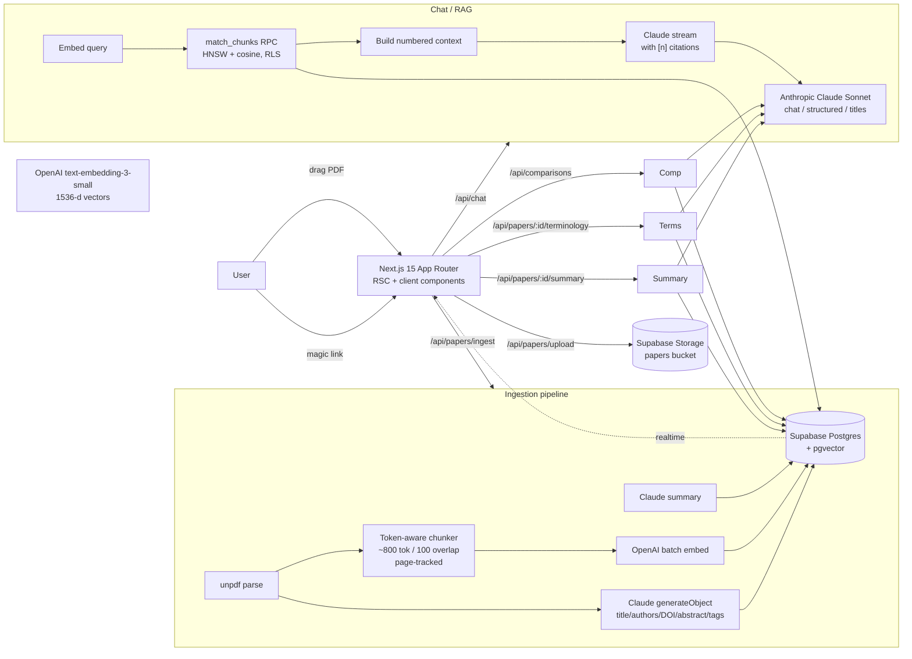

# POAR Research Assistant

> AI research assistant for prosthetics, orthotics, biomechanics, and rehabilitation robotics papers.

[](https://nextjs.org)
[](https://www.typescriptlang.org)
[](https://supabase.com)
[](https://www.anthropic.com)
[](https://openai.com)
[](https://sdk.vercel.ai)
[](https://tailwindcss.com)
[](LICENSE)

---

## Project Overview

**POAR** stands for **Prosthetics, Orthotics, and Assistive Robotics**. POAR
Research Assistant is an AI-powered biomedical research workspace built for
clinicians, biomedical engineering students, and researchers reading literature
in the prosthetics / orthotics / biomechanics / rehabilitation robotics space.

Drop a PDF in, the app:

- extracts metadata, embeds the full text, writes a Claude summary;
- lets you chat with one paper or your whole library, with every claim cited
  back to a specific page;
- generates structured, sectioned summaries with retry / regenerate / version
  history;
- extracts domain terminology with three explanation depths (beginner,
  technical, clinical context);
- compares any two papers side by side with a similarity score, contradiction
  detection, and a "which paper is methodologically stronger" verdict.

Designed and shipped as a portfolio project, but production-shaped:
end-to-end RLS, keyset pagination, structured outputs with citation
resolution, mobile responsive, deployable to Cloudflare.

---

## Features

| Feature | What it does |
| --- | --- |
| **Library** | Drag-drop PDF upload (signed Supabase Storage URLs), live status badges, paper grid, multi-tag filters grouped by domain category. |
| **Ingestion** | `unpdf` text extraction -> Claude metadata (title / authors / DOI / abstract / tags) -> token-aware chunking with page tracking -> OpenAI embeddings -> Claude summary. Status pushed via Supabase Realtime. |
| **Per-paper chat** | Streaming Claude answers with inline `[n]` citations, click a citation to jump to that PDF page. Conversations persist with auto-generated titles. |
| **Cross-library chat** | Same RAG pipeline, no `paper_id` filter. Citation badges link to the source paper. |
| **Conversation sidebar** | Pin / archive / rename / delete, time grouping (Today / Yesterday / Previous 7 days / Older), debounced search across titles and message contents, keyset pagination, mobile drawer, `Ctrl+K` to search, `Ctrl+Shift+O` for new chat. |
| **Structured Summary** | Seven sections (Abstract / Methods / Findings / Limitations / Clinical Relevance / POAR Relevance / Future Directions), every section cites supporting chunks, version history, regenerate. |
| **Terminology Explain Mode** | 15-30 extracted terms grouped by category, three explanation levels (beginner / technical / clinical context), pronunciation hints, full-text filter, click-card detail drawer. |
| **Compare Papers** | Picker page, generates an 8-section side-by-side comparison + contradiction list + similarity score (0-1) + stronger-paper verdict. Citations are prefixed `A p.4` / `B p.7` and link to the source paper. |
| **History** | Unified history page with tabs for Summaries / Terminology / Comparisons, search across titles and contents, pin / archive / delete. |
| **Settings** | Per-feature counters, model identifiers, env-var health checks, full categorized POAR tag vocabulary view. |

---

## Tech Stack

- **Frontend**: Next.js 15 (App Router, RSC, route handlers), TypeScript, Tailwind CSS 4, shadcn-style primitives, `react-pdf` viewer, lucide icons.
- **Backend**: Supabase Postgres + `pgvector`, Supabase Auth (email magic link), Supabase Storage (private bucket).
- **AI**: Anthropic Claude Sonnet via [Vercel AI SDK](https://sdk.vercel.ai) (`@ai-sdk/anthropic`) for chat, structured outputs (`generateObject` + Zod), summaries, comparisons; OpenAI `text-embedding-3-small` (1536-d) for embeddings.
- **PDF**: `unpdf` (text extraction in serverless), `react-pdf` + `pdfjs-dist` (in-browser viewer).
- **Hosting**: Cloudflare Pages / Workers via `@opennextjs/cloudflare`.

---

## Architecture



### Project layout

```
src/
  app/
    layout.tsx, page.tsx           shell + auth-aware nav, root redirect
    login/                         magic-link form (Suspense-wrapped)
    auth/{callback,signout}/       OAuth/OTP exchange + sign-out POST
    library/                       paper grid, upload, categorized tag filter
    papers/[id]/                   tabs: Chat / Summary / Terms; PDF viewer left
    chat/, chat/[id]/              cross-library workspace + sidebar
    compare/, compare/[id]/        picker + side-by-side comparison view
    history/                       unified analyses history
    settings/                      counters, env health, vocabulary
    api/
      papers/                      list, upload, ingest, [id] CRUD
      papers/[id]/summary          generate / get latest + version list
      papers/[id]/terminology      generate / get latest + version list
      summaries/[id]               GET / PATCH / DELETE
      terminology/[id]             GET / PATCH / DELETE
      comparisons[/[id]]           list / generate, GET / PATCH / DELETE
      analyses                     unified history (rank-fused FTS)
      chat                         streaming RAG endpoint
      chats[/[id][/title]]         conversation CRUD, title regen
      search                       hybrid vector + tsvector search
    error.tsx, not-found.tsx, loading.tsx, global-error.tsx
  lib/
    supabase/{client,server,admin}.ts
    ai/{anthropic,openai,prompts,title}.ts
    ingest/                        parse / chunk / embed / metadata / summary / orchestrator
    analyses/                      paperContext, prompts, schemas, generators, resolve
    chats/                         keyset cursor helpers
    tags.ts                        typed categorized POAR vocabulary + normaliser
    utils.ts, env.ts
  components/
    ui/                            button, input, card, badge, textarea, tabs,
                                   collapsible, drawer, skeleton
    chat/                          ConversationSidebar, ConversationItem,
                                   useConversations, ChatWorkspaceLayout, timeGroups
    analyses/                      CitationBadges
  types/db.ts                      hand-written DB schema
middleware.ts                      auth gate
supabase/migrations/               0001 init -> 0005 analyses
docs/DEPLOYMENT.md                 Cloudflare Pages walkthrough
wrangler.toml, open-next.config.ts Cloudflare config
```

---

## AI / RAG Pipeline

### 1. PDF ingestion
- Browser PUTs the file directly to Supabase Storage with a one-shot signed URL.
- Server route fetches it back, runs `unpdf` for per-page text extraction, normalises hyphenated line breaks, and produces a clean per-page text array.

### 2. Metadata extraction
- The first ~3 pages plus the categorized tag vocabulary are sent to Claude via the AI SDK's `generateObject`, constrained by a Zod schema (`title`, `authors[]`, `journal`, `year`, `doi`, `abstract`, `tags[]`).
- Returned tags pass through `dedupeAndNormalizeTags` which maps acronyms (`BCI` -> `brain-computer-interface`, `FES` -> `functional-electrical-stimulation`, etc.) and rejects anything outside the controlled vocabulary.

### 3. Chunking
- Paragraph-aware, ~800 token chunks with 100-token overlap, never crossing more than two pages.
- Cheap regex section detection labels chunks as `abstract` / `methods` / `results` / `discussion`.
- Each chunk records `page_start`, `page_end`, `section`, `tokens`.

### 4. Embeddings
- OpenAI `text-embedding-3-small` (1536-d), batched up to 96 inputs per call.
- Stored in `chunks.embedding vector(1536)` with an HNSW cosine index.

### 5. Summary
- Claude writes a ~250-word technical prose summary covering aim / population / methods / results / clinical implications.

### 6. Retrieval (chat)
- Query string is embedded with the same OpenAI model.
- `match_chunks(query_embedding, k, filter_paper_id?)` is a Postgres function that runs under RLS (`security invoker`), returns top-k by cosine similarity, and supports an optional paper filter for per-paper chats.

### 7. Generation (chat)
- Top-k chunks are wrapped in a numbered context block (`[1] (paper id, p.4) ...`).
- The system prompt instructs Claude to cite as `[n]` and refuse claims that are not in context.
- The response streams via `createDataStreamResponse`; a `data` annotation carries the resolved `Citation[]` so the UI can render clickable badges *as the answer streams*.
- After the stream finishes, both turns are persisted, and on the first turn Claude generates a 4-8 word chat title that surfaces back into the sidebar.

### 8. Structured analyses (Summary / Terminology / Comparison)
- The same chunk store powers them. `loadPaperContext()` builds a numbered context block (`[A3]`, `[B7]` for comparisons) and a 1-indexed `Citation[]` registry.
- Each generator calls `generateObject` against a Zod schema that requires `citations: number[]` (or `string[]` like `"A3"`) per cited field.
- After generation, citation references are resolved into real `Citation` objects, the payload + registry are stored, and the UI re-resolves on read so links keep working forever.
- Outputs are versioned (`version int` per `(user_id, paper_id)` or `(user_id, paper_a_id, paper_b_id)`), so regenerate creates a new row and old versions remain reachable from the in-tab Versions list.

### 9. Hybrid search
- `hybrid_search(query_text, query_embedding, k)` uses Reciprocal Rank Fusion across vector similarity and `tsvector` full-text rankings, deduped per `(paper_id, page)` window.

### 10. Realtime
- The papers table is added to the `supabase_realtime` publication. The library page subscribes and updates ingestion status badges live (`pending -> parsing -> embedding -> ready`) with no polling.

---

## Screenshots

> Screenshots will be added once a public demo at <https://research.advien.tech> is live.

| | |
| --- | --- |
| Library + tag filter | _placeholder_ |
| Paper view: PDF + chat with inline citations | _placeholder_ |
| Structured Summary tab | _placeholder_ |
| Terminology Explain Mode | _placeholder_ |
| Compare Papers side-by-side | _placeholder_ |
| Conversation sidebar | _placeholder_ |

---

## Local Development

```bash
# 1. Install
npm install

# 2. Configure env
cp .env.example .env.local        # then fill in the five required keys

# 3. Stand up Supabase (or link a hosted project)
supabase link --project-ref <ref>
supabase db push                  # applies migrations 0001 -> 0005

# 4. Run
npm run dev                       # http://localhost:3000
```

### Useful scripts

```bash
npm run dev          # Next.js dev server
npm run build        # production build
npm run start        # serve the production build
npm run lint         # next lint
npm run typecheck    # tsc --noEmit
npm run check        # lint + typecheck

npm run db:push      # apply local migrations to the linked Supabase project
npm run db:reset     # wipe + replay (local only)
npm run db:types     # regenerate src/types/db.ts from a linked project

npm run cf:build     # build a Cloudflare Worker bundle via @opennextjs/cloudflare
npm run cf:preview   # serve the worker locally via Wrangler
npm run cf:deploy    # deploy to Cloudflare
```

---

## Environment Variables

See [.env.example](.env.example) for the canonical template. Five vars are
required:

| Variable | Public? | Purpose |
| --- | --- | --- |
| `NEXT_PUBLIC_SUPABASE_URL` | yes | Supabase project URL |
| `NEXT_PUBLIC_SUPABASE_ANON_KEY` | yes | Browser auth + anon-RLS reads |
| `SUPABASE_SERVICE_ROLE_KEY` | **no - server-only** | Ingestion pipeline (bypasses RLS for chunk writes) |
| `ANTHROPIC_API_KEY` | **no** | Claude chat / structured outputs / titles |
| `OPENAI_API_KEY` | **no** | Embeddings (`text-embedding-3-small`) |
| `NEXT_PUBLIC_APP_URL` | yes | `http://localhost:3000` locally, `https://research.advien.tech` in prod |

---

## Supabase Setup

1. Create a Supabase project. Save the database password.
2. **Project Settings -> API**: copy URL, anon key, service-role key.
3. **Database -> Extensions**: confirm `vector` is enabled (auto-enabled by `0001_init.sql`).
4. **Authentication -> URL Configuration**:
   - **Site URL**: `http://localhost:3000` for dev, `https://research.advien.tech` for prod
   - **Additional Redirect URLs**: include `http://localhost:3000/auth/callback` and the production callback
5. Push migrations:

```bash
supabase link --project-ref <ref>
supabase db push
```

Or paste each `supabase/migrations/000X_*.sql` file into the SQL Editor in
order.

### Migrations

| File | Purpose |
| --- | --- |
| `0001_init.sql` | extensions, papers / chunks / chats / messages tables, RLS, `match_chunks` and `hybrid_search` RPCs |
| `0002_storage.sql` | private `papers` bucket + per-user storage policies |
| `0003_realtime.sql` | adds `papers` to the realtime publication |
| `0004_chat_history.sql` | conversation pin / archive / `last_message_at` / `message_count` + `search_chats` RPC |
| `0005_analyses.sql` | `paper_summaries`, `paper_terminology`, `paper_comparisons` + unified `search_analyses` RPC |

All migrations are idempotent.

---

## Deployment

The project deploys to **Cloudflare Pages / Workers** via the
`@opennextjs/cloudflare` adapter. Production target: `https://research.advien.tech`.

Full walkthrough in [`docs/deployment/cloudflare-pages.md`](docs/deployment/cloudflare-pages.md), including:

- one-time install of `@opennextjs/cloudflare` and Wrangler
- Cloudflare project setup (Workers & Pages, build command, output dir, `nodejs_compat`)
- secrets via `wrangler secret put`
- custom domain wiring
- Supabase auth redirect configuration for both localhost and production
- preview / deploy commands
- a deployment checklist
- known constraints (CPU time, bundle size, PDF.js worker, Realtime over WebSockets)

---

## Biomedical / POAR Context

**Why this exists.** Reading prosthetics, orthotics, and assistive-robotics
literature is heavy work. Papers mix biomechanics, control theory, clinical
trial methodology, and device-specific jargon. A clinician hunting for the
right outcome measure for a transtibial socket trial, an MSc student trying
to compare two exoskeleton control strategies, or a researcher checking
whether two studies on FES-assisted gait actually contradict each other -
they all spend disproportionate time on mechanics that an LLM with retrieval
can take care of.

POAR Research Assistant is opinionated about the field:

- **Vocabulary.** A controlled tag vocabulary spans Prosthetics, Orthotics,
  Robotics, Neurorehabilitation, Biomechanics, Sensors & Control, Clinical
  Context, and Methods - acronyms (BCI, FES, IMU, sEMG, MPC, RL, SEA, AFO,
  KAFO, TLSO) all normalise to canonical slugs at extraction time.
- **Domain primer.** Every Claude prompt is anchored in P&O / O&P / robotics
  domain knowledge: device classes, amputation levels, sensors, control laws,
  outcome measures (PEQ, LCI, AMP, 6MWT, SF-36).
- **Sectioned summaries.** Structured summaries always include a dedicated
  *POAR Relevance* section calling out what the paper specifically contributes
  to prosthetics / orthotics / assistive-robotics practice or design.
- **Comparison verdicts.** The compare workflow surfaces methodology,
  participants, outcome measures, devices and sensors, rehab approach,
  strengths, weaknesses, and clinical implications side by side; it then
  scores similarity 0-1 and tags one paper as stronger when one clearly is.

The historical industry term "P&O" / "O&P" is preserved verbatim inside any
quoted scientific text or citation - we only updated the *project* identity.

---

## Roadmap

### Done (M0 - present)
- PDF ingestion pipeline with Realtime status
- Per-paper and cross-library RAG chat with streaming + citations
- Persistent chat history with sidebar, pin / archive / search
- Structured Summary, Terminology, and Compare Papers features
- Unified analyses history page
- Cloudflare Pages deployment scaffolding

### Planned
- **OCR fallback** for scanned PDFs (Claude vision)
- **Notes & highlights** with anchors back into the PDF
- **Zotero / BibTeX / DOI auto-import**
- **Multi-user sharing & team libraries** (RLS already factored for it)
- **Background job queue** + retry UI for ingestion at scale
- **Research session history** linking chats, summaries, and comparisons into named projects
- **Robotics-specific extraction**: actuation type, control law, intent-detection modality, sensor suite, DoF, mass, runtime
- **Cross-paper synthesis** ("what does my library say about X?")
- **Public dataset linkage** (Ninapro, OpenSim) referenced in papers
- **Real-time collaborative annotations**

---

## Documentation

In-depth engineering and product documentation lives in [`docs/`](docs/README.md):

- [Architecture overview](docs/architecture/system-overview.md)
- [Database schema reference](docs/database/schema.md)
- [RAG pipeline + tradeoffs](docs/rag-pipeline/retrieval-flow.md)
- Feature docs: [Library](docs/features/library.md), [Chat](docs/features/chat.md), [Structured Summaries](docs/features/structured-summaries.md), [Terminology](docs/features/terminology.md), [Compare Papers](docs/features/compare-papers.md), [Research History](docs/features/research-history.md)
- [Cloudflare Pages deployment](docs/deployment/cloudflare-pages.md)
- [Architecture decision records](docs/engineering/decisions.md)
- [Future features](docs/roadmap/future-features.md)
- [Portfolio project summary](docs/portfolio/project-summary.md)

## License

MIT. See [LICENSE](LICENSE).
