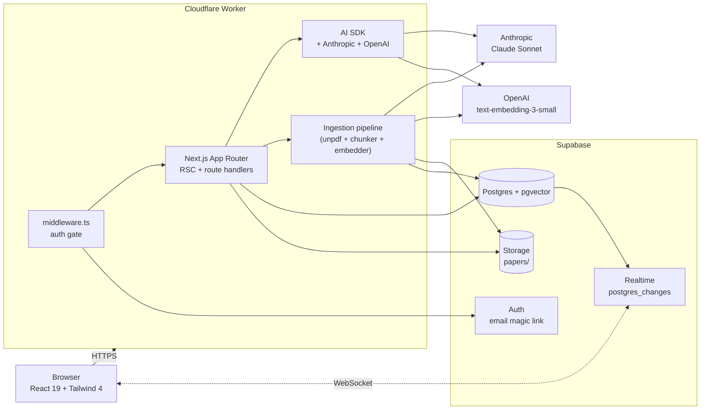
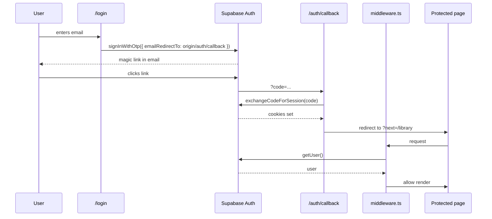
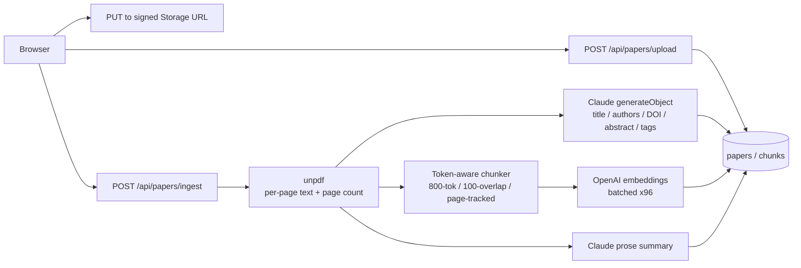
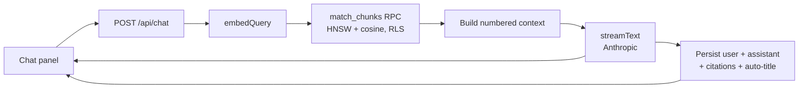
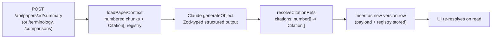

# System Overview

POAR Research Assistant is a Next.js 15 App Router application with a Supabase
backend (Postgres + pgvector + Auth + Storage + Realtime), Anthropic Claude for
generation, and OpenAI for embeddings. Everything runs in a single deployable
Worker on Cloudflare via [`@opennextjs/cloudflare`](https://opennext.js.org/cloudflare).

## Component map

The browser talks to a single origin. There is no separate API server; route
handlers under `src/app/api/` are colocated with the React tree and execute on
the Worker.

## Layered model

| Layer | Where | Responsibility |
| --- | --- | --- |
| Presentation | `src/app/**/page.tsx`, `src/components/**` | RSC server pages, client islands, shadcn-style primitives. |
| Server logic | `src/app/api/**/route.ts`, `src/app/auth/**/route.ts` | HTTP boundary. Validate input (Zod), enforce auth, call services. |
| Domain services | `src/lib/ingest/`, `src/lib/analyses/`, `src/lib/ai/`, `src/lib/chats/` | Stateless business logic. No HTTP. No request objects. |
| Persistence | `src/lib/supabase/{client,server,admin}.ts` | Three Supabase clients (browser, RLS server, service-role). |
| Schema | `supabase/migrations/000X_*.sql`, `src/types/db.ts` | SQL is the source of truth; TS types are hand-written and exhaustively cover the surface used by the app. |

## Auth flow

- The login page uses `window.location.origin` to build the redirect URL, so
  the same code works on `localhost:3000` and `research.advien.tech`.
- Supabase must be configured to accept both origins. See the
  [Cloudflare deployment doc](../deployment/cloudflare-pages.md).
- `middleware.ts` runs on every non-static request and bounces unauthenticated
  traffic to `/login?next=<path>`. Routes under `/auth/*` are exempt.

## Ingestion flow

Status transitions on the `papers` row: `pending -> parsing -> embedding -> ready`
or `failed` with the error captured in `error text`. Realtime broadcasts each
update so the library grid animates with no polling.

The pipeline runs **inline** in the route handler with `maxDuration = 300`. For
production scale this should move behind a queue; see the [roadmap](../roadmap/future-features.md).

## Chat / RAG flow

Citations are written into the data stream as a `{type:"citations", citations,
chat_id}` annotation **before** the text starts streaming, so the UI can render
clickable `[n]` badges as the answer arrives. After the stream finishes,
Claude generates a 4-8 word title for the conversation.

Full retrieval details, including chunk numbering and prompt construction, are
in [`docs/rag-pipeline/retrieval-flow.md`](../rag-pipeline/retrieval-flow.md).

## Structured analyses flow

The Summary, Terminology, and Comparison features all share the same shape:

- A `loadPaperContext()` helper fetches all chunks for a paper, builds a
  numbered prompt block, and emits a 1-indexed `Citation[]` registry.
- `generateObject` enforces a Zod schema so each cited field carries
  `citations: number[]` (or `string[]` like `"A3"` for comparisons).
- The UI re-resolves the citation arrays on every render, so saved analyses
  remain link-functional indefinitely.

## Realtime updates

The `papers` table is added to the `supabase_realtime` publication
(migration 0003). The library client subscribes to `postgres_changes` and
patches its in-memory list on INSERT / UPDATE / DELETE. There is no polling.

Realtime is **not** used for chat streaming - that uses the AI SDK's data
stream protocol over a single HTTP connection.

## Routing & navigation

| Route | Server / client | Notes |
| --- | --- | --- |
| `/` | server | Redirects to `/library` if signed in, else `/login`. |
| `/login` | client | Suspense-wrapped `useSearchParams`; `signInWithOtp` with dynamic origin. |
| `/auth/callback` | server route | Exchanges code for session; redirects to `?next`. |
| `/auth/signout` | server route | POSTs `signOut`; redirects to `/login`. |
| `/library` | server -> client island | Server-fetches initial papers; client owns Realtime sub + filters. |
| `/papers/[id]` | server -> client | Server fetches paper + active chat + chat history; client owns Tabs (Chat / Summary / Terms). |
| `/chat`, `/chat/[id]` | server -> client | Workspace shell with sidebar + main pane. Paper-scoped chats redirect into `/papers/[id]?chat=...`. |
| `/compare`, `/compare/[id]` | server -> client | Picker + side-by-side comparison view. |
| `/history` | server -> client | Tabs for All / Summaries / Terminology / Comparisons via the `search_analyses` RPC. |
| `/settings` | server | Read-only; counters, env health, full vocabulary. |

## Error handling

- `src/app/global-error.tsx` - root-level fallback that includes its own
  `<html>/<body>`, styled inline so it renders even when the layout itself
  crashes.
- `src/app/error.tsx` - segment-level boundary with retry + back-to-library.
- Per-feature: `src/app/papers/[id]/error.tsx`, `src/app/compare/[id]/error.tsx`.
- `src/app/not-found.tsx` and `src/app/loading.tsx` are app-wide defaults.

## Security model

- All four user-owned tables (`papers`, `chunks`, `chats`, `messages`) and the
  three analyses tables (`paper_summaries`, `paper_terminology`,
  `paper_comparisons`) have `enable row level security` with
  `auth.uid() = user_id` policies.
- The Storage bucket `papers` is private; per-user policies on
  `storage.objects` gate read/write/delete by the leading folder
  (`(storage.foldername(name))[1] = auth.uid()::text`).
- The service-role client (`src/lib/supabase/admin.ts`) is used **only** by the
  ingestion pipeline to insert chunks under RLS bypass after the API route has
  already verified ownership of the paper. It is never imported from a client
  component.
- All API routes call `supabase.auth.getUser()` first and return 401 before
  doing any work.
