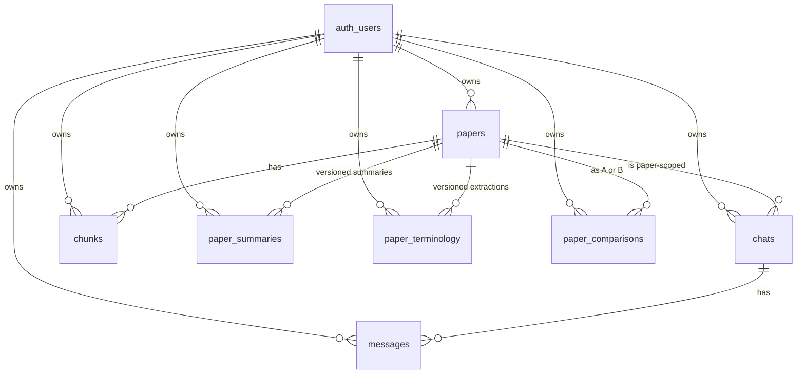

# Database Schema Reference

The Postgres schema is the source of truth. TS types in `src/types/db.ts` are
hand-derived to match. All tables live in the `public` schema; Storage objects
in the `storage.objects` table.

Every user-owned table follows the same pattern: `user_id uuid` references
`auth.users`, **row-level security is enabled**, and a `using (auth.uid() =
user_id)` policy gates every operation.

Migrations:

| File | Purpose |
| --- | --- |
| [`0001_init.sql`](../../supabase/migrations/0001_init.sql) | extensions, papers / chunks / chats / messages, RLS, `match_chunks`, `hybrid_search` |
| [`0002_storage.sql`](../../supabase/migrations/0002_storage.sql) | `papers` bucket + per-user policies |
| [`0003_realtime.sql`](../../supabase/migrations/0003_realtime.sql) | adds `papers` to the realtime publication |
| [`0004_chat_history.sql`](../../supabase/migrations/0004_chat_history.sql) | conversation pin / archive / activity columns + `search_chats` RPC |
| [`0005_analyses.sql`](../../supabase/migrations/0005_analyses.sql) | `paper_summaries`, `paper_terminology`, `paper_comparisons` + `search_analyses` RPC |

Migrations are idempotent and safe to re-apply.

## Extensions

```sql
create extension if not exists "uuid-ossp";   -- legacy, primary keys now use gen_random_uuid()
create extension if not exists vector;        -- pgvector, hosted Supabase enables it by default
```

## Entity-relationship overview



## Tables

### `papers`

Top-level record per uploaded PDF.

| Column | Type | Notes |
| --- | --- | --- |
| `id` | `uuid pk` | `gen_random_uuid()` |
| `user_id` | `uuid` | -> `auth.users(id)` cascade delete |
| `title`, `journal`, `doi`, `abstract` | `text` | nullable; populated by metadata extraction |
| `authors` | `text[]` | default `'{}'` |
| `year` | `int` | |
| `tags` | `text[]` | controlled vocabulary; see [`src/lib/tags.ts`](../../src/lib/tags.ts) |
| `storage_path` | `text` | `{user_id}/{paper_id}.pdf` in the `papers` bucket |
| `page_count` | `int` | from `unpdf` |
| `status` | `text check (...)` | `pending` / `parsing` / `embedding` / `ready` / `failed` |
| `error` | `text` | populated when `status='failed'` |
| `summary` | `text` | Claude-written prose summary stored at ingestion |
| `created_at`, `updated_at` | `timestamptz` | `touch_updated_at` trigger |

**Indexes**: `(user_id)`, `(user_id, status)`, GIN on `tags`.

### `chunks`

The vector store. One row per ~800-token slice of a paper.

| Column | Type | Notes |
| --- | --- | --- |
| `id` | `uuid pk` | |
| `paper_id`, `user_id` | `uuid` | both cascade |
| `chunk_index` | `int` | unique with `paper_id` |
| `page_start`, `page_end`, `section`, `tokens` | mixed | section ∈ {abstract, methods, results, ...} via regex |
| `content` | `text not null` | the chunk text |
| `embedding` | `vector(1536)` | OpenAI `text-embedding-3-small` |
| `tsv` | `tsvector` generated | `to_tsvector('english', content)`; backs FTS |
| `created_at` | `timestamptz` | |

**Indexes**:
- `unique (paper_id, chunk_index)`
- `(user_id)`
- GIN on `tsv`
- HNSW on `embedding vector_cosine_ops` with `m = 16, ef_construction = 64`

### `chats`

A conversation, optionally scoped to a single paper.

| Column | Type | Notes |
| --- | --- | --- |
| `id`, `user_id` | `uuid` | |
| `paper_id` | `uuid?` | NULL = cross-library chat |
| `title` | `text` | starts as a fallback truncation of the first user message; replaced by Claude-generated title after the first turn |
| `archived`, `pinned` | `bool` | for the sidebar |
| `last_message_at` | `timestamptz` | denormalized via trigger; drives sidebar ordering |
| `message_count` | `int` | denormalized via trigger |
| `metadata` | `jsonb` | reserved for future use |
| `title_tsv` | `tsvector` generated | title + headline payload fields, indexed for FTS |
| `created_at`, `updated_at` | `timestamptz` | |

**Indexes**:
- `(user_id, archived, pinned desc, last_message_at desc nulls last, id desc)` — sidebar primary query
- `(user_id, paper_id, last_message_at desc nulls last)` — per-paper history
- GIN on `title_tsv`

**Trigger**: `bump_chat_on_message` (after insert/delete on `messages`) keeps
`message_count` and `last_message_at` correct.

### `messages`

Append-only conversation log.

| Column | Type | Notes |
| --- | --- | --- |
| `id`, `chat_id`, `user_id` | `uuid` | cascades from chats and auth |
| `role` | `text check in ('user','assistant','system')` | |
| `content` | `text` | |
| `citations` | `jsonb` | `Citation[]` snapshot at the time of the assistant turn |
| `tsv` | `tsvector` generated | indexed for chat-content search |
| `created_at` | `timestamptz` | |

**Indexes**: `(chat_id, created_at)`, GIN on `tsv`.

### `paper_summaries`

Versioned structured summaries. One row per regeneration.

| Column | Type | Notes |
| --- | --- | --- |
| `id`, `user_id`, `paper_id` | `uuid` | |
| `version` | `int` | unique with `(user_id, paper_id)`; latest = current |
| `payload` | `jsonb` | `StructuredSummaryT` from [`src/lib/analyses/schemas.ts`](../../src/lib/analyses/schemas.ts) |
| `citations` | `jsonb` | the 1-indexed `Citation[]` registry the model cited against |
| `title` | `text` | "Summary of \"...\"" or `Summary v{n}` |
| `pinned`, `archived` | `bool` | |
| `model`, `prompt_version` | `text` | for reproducibility |
| `title_tsv` | `tsvector` generated | combines title + abstract_summary + main_findings |
| `created_at`, `updated_at` | `timestamptz` | |

**Indexes**: `(user_id, paper_id, version desc)`, `(user_id, archived, pinned desc, created_at desc, id desc)`, GIN on `title_tsv`.

### `paper_terminology`

Same shape as summaries but for extracted terms.

| Column | Type | Notes |
| --- | --- | --- |
| `payload` | `jsonb` | `{ terms: TermT[], __searchable }` |
| `citations` | `jsonb` | per-term `citations: number[]` resolve against this registry |
| `term_count` | `int` | denormalized count for cheap UI |
| `terms_tsv` | `tsvector` generated | flattened `__searchable` blob (term names + expansions + categories) |

Indexes mirror `paper_summaries`.

### `paper_comparisons`

Versioned side-by-side comparisons.

| Column | Type | Notes |
| --- | --- | --- |
| `paper_a_id`, `paper_b_id` | `uuid` | both cascade |
| `version` | `int` | unique with `(user_id, paper_a_id, paper_b_id)` |
| `payload` | `jsonb` | `PaperComparisonT` |
| `citations` | `jsonb` | array of `{ ref, chunk_id, paper_id, page_start, page_end, snippet }` with `ref` like `"A3"` / `"B7"` |
| `similarity_score` | `real` | 0.0 to 1.0 |
| `stronger_paper` | `text check in ('a','b','tie','undetermined')` | |
| `contradiction_count` | `int` | denormalized for the history list |
| `title_tsv` | `tsvector` generated | combines title + overall_assessment |

**Constraint**: `paper_a_id < paper_b_id` (lexicographic on uuid). The
generator always normalises the pair before insert via `orderPaperIds()`, so
the unique key is stable regardless of selection order.

**Indexes**: `(user_id, paper_a_id, paper_b_id, version desc)`,
`(user_id, archived, pinned desc, created_at desc, id desc)`,
`(user_id, paper_b_id)` (reverse-direction lookup), GIN on `title_tsv`.

## Storage

Bucket `papers`:

- private, max object 100 MB, only `application/pdf` accepted
- path: `{user_id}/{paper_id}.pdf`
- four `storage.objects` policies (`select` / `insert` / `update` / `delete`)
  all require `(storage.foldername(name))[1] = auth.uid()::text`

Browser uploads use one-shot signed upload URLs minted by
`POST /api/papers/upload`; the server never proxies the bytes.

## Row-level security

Every user-owned table:

```sql
alter table public.<t> enable row level security;
create policy "<t>: owner all" on public.<t>
  for all using (auth.uid() = user_id) with check (auth.uid() = user_id);
```

Implications:

- The browser-side `anon` client (in `src/lib/supabase/client.ts`) is safe
  even with the public anon key, because Postgres enforces `auth.uid()`
  scoping per session cookie.
- The service-role client (`src/lib/supabase/admin.ts`) **bypasses** RLS and
  is only used by the ingestion pipeline after the API route has verified
  ownership.

## RPC functions

All RPCs are `security invoker` and gate on `auth.uid()`, so an authenticated
session is enough to call them safely.

### `match_chunks(query_embedding, match_count = 8, filter_paper_id = null)`

Cosine-similarity nearest-neighbour search over `chunks.embedding`.

```sql
order by c.embedding <=> query_embedding
limit greatest(1, least(match_count, 50));
```

`match_count` is clamped to 50 to keep prompts well under context limits.

### `hybrid_search(query_text, query_embedding, match_count = 12, filter_paper_id = null, rrf_k = 60)`

Reciprocal Rank Fusion of vector NN and `tsvector` full-text rankings:

```sql
score = sum(1.0 / (rrf_k + rnk))
```

over the union of `vector_hits` (top `4*match_count` by cosine) and `fts_hits`
(top `4*match_count` by `ts_rank`). RRF is order-agnostic and removes the need
to tune a vector-vs-FTS weight - both feeds carry equal influence and the
intersection naturally rises.

### `search_chats(q, filter_paper_id = null, include_archived = false, match_count = 30)`

Rank-fused search over `chats.title_tsv` (weight 2.0) and `messages.tsv`
(weight 1.0), grouped by chat.

### `search_analyses(q, filter_kind = null, filter_paper_id = null, include_archived = false, match_count = 30)`

Single union over `paper_summaries.title_tsv`, `paper_terminology.terms_tsv`,
`paper_comparisons.title_tsv`. Each hit returns a discriminated `kind` column
(`summary` / `terminology` / `comparison`), so the unified history page can
render mixed lists from one query.

## Why pgvector

- **One database**. Auth, papers metadata, chunks, embeddings, chats,
  comparisons, full-text indexes - everything lives in Postgres. RLS works
  uniformly across all of them.
- **Joinable**. The retrieval RPC can filter by `user_id` and `paper_id` in
  the same query that does ANN. With an external vector store (Pinecone,
  Qdrant, Weaviate) this becomes a two-phase fetch: query the vector DB,
  then a second query against Postgres to hydrate.
- **HNSW** in pgvector ≥ 0.5 is fast enough for portfolio scale (tens of
  thousands of chunks).
- **Cost**. Free Supabase tier covers personal use; no extra paid service.

If the corpus grows past the point where HNSW recall / latency become a
problem (rough rule of thumb: > 5M vectors per user), a dedicated vector store
plus a periodic sync job is the natural next step.

## Why hybrid search

Pure vector search misses literal keyword hits that the embedding model
"smoothes over" (DOIs, drug names, model identifiers, exact device names).
Pure FTS misses paraphrases (a query about "metabolic cost reduction" will not
match "energy expenditure decrease" without an embedding).

RRF gives the union the best of both:

- A chunk ranked highly by both modalities scores extremely well.
- A chunk ranked only by FTS still surfaces (literal acronym match).
- A chunk ranked only by vectors still surfaces (semantic paraphrase).
- No magic vector-vs-FTS weight to tune.

The `hybrid_search` RPC is exposed via `POST /api/search` and used wherever
keyword precision matters (e.g. cross-library lookups in the search field). The
chat path still uses `match_chunks` (pure vector) because the LLM tolerates
paraphrase well and the prompt budget is the binding constraint.
