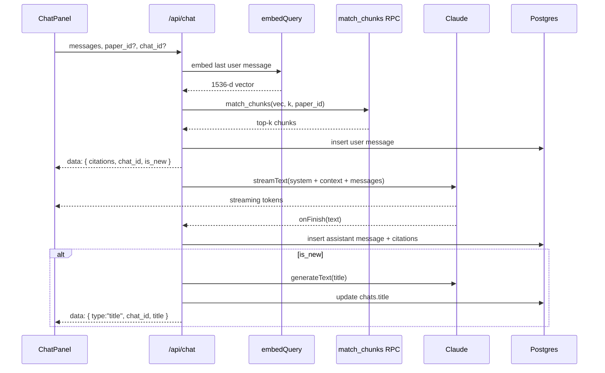

# Feature: Chat

Streaming RAG chat against one paper or the whole library, with persistent
conversations, an auto-titled sidebar, and inline page-level citations.

## Purpose

Most "what does this paper say about X" questions take longer to answer by
hand than to ask. The chat surface gives the user a Claude conversation
grounded in their own library, with citations the user can click to jump to
the source page in the in-app PDF viewer.

## UX flow

### Per-paper chat
1. Open `/papers/[id]` -> Chat tab is the default.
2. Top-of-panel banner: previous-conversations dropdown + "New chat" button.
3. Type a question, hit Enter (Shift+Enter for newline).
4. Stream begins. `[1]`, `[2]` markers appear inline as Claude speaks.
5. Click any `[n]` -> the PDF viewer jumps to that page.
6. After the first turn, the chat is auto-titled and listed under the paper's history.

### Cross-library chat
1. Top nav -> **Chat** -> `/chat` workspace with sidebar + empty pane.
2. Type a question. Same RAG flow but k=12 (instead of 8) and no `paper_id` filter.
3. Citations link to `/papers/{paper_id}` (the source paper opens with the same chat preserved).
4. After the first turn, the URL replaces to `/chat/<chatId>` so the conversation is bookmarkable / linkable.

### Sidebar
- Pinned section first, then time-bucketed groups (Today / Yesterday / Previous 7 days / Older).
- Each row shows paper context (or "Library"), message count, relative time, hover actions for pin / rename / archive / delete.
- `Ctrl+K` focuses search; `Ctrl+Shift+O` starts a new conversation.
- Mobile: hamburger opens the same sidebar inside a slide-over `<Drawer>`.

## Technical implementation

- Endpoint: [`src/app/api/chat/route.ts`](../../src/app/api/chat/route.ts).
- Streaming: AI SDK v4 `streamText` + `createDataStreamResponse`. Citations are emitted as a `data` annotation **before** text starts streaming so the UI can render `[n]` badges live.
- Persistence: user turn is inserted before streaming starts, assistant turn (with citations snapshot) in `onFinish`. Auto-titling happens in the same `onFinish` and is pushed back as a second `data` annotation.
- Resume: server pages preload `messages` from DB and seed `useChat({ id, initialMessages })`. Citation history is split into two arrays (`seedCitations` from DB-loaded turns + `streamCitations` from live `data`); the i-th assistant message looks up the right one via index math.
- URL sync: when a new chat is created, the `useChat` `data` carries `is_new=true` + the new id. The client gates `router.replace('/chat/<id>')` until `isLoading` is false, otherwise the streaming connection would be killed mid-flight.
- Sidebar state: [`src/components/chat/useConversations.ts`](../../src/components/chat/useConversations.ts) owns search, cursor pagination, and optimistic mutations (pin / archive / rename / delete). All mutations roll back on error.
- Pagination: keyset cursor on `(last_message_at, id)` via [`src/lib/chats/cursor.ts`](../../src/lib/chats/cursor.ts).
- Search: `search_chats` RPC unions title + message-content rankings.

## Data flow

## Future improvements

- Persist partial assistant messages on disconnect.
- Per-paper "suggested questions" surfaced from the chunk distribution.
- Voice input / dictation.
- Branching conversations (fork a turn).
- Per-conversation pinned papers (a conversation can keep its working set across paper boundaries).
- Export a conversation to Markdown / Notion / Obsidian.
