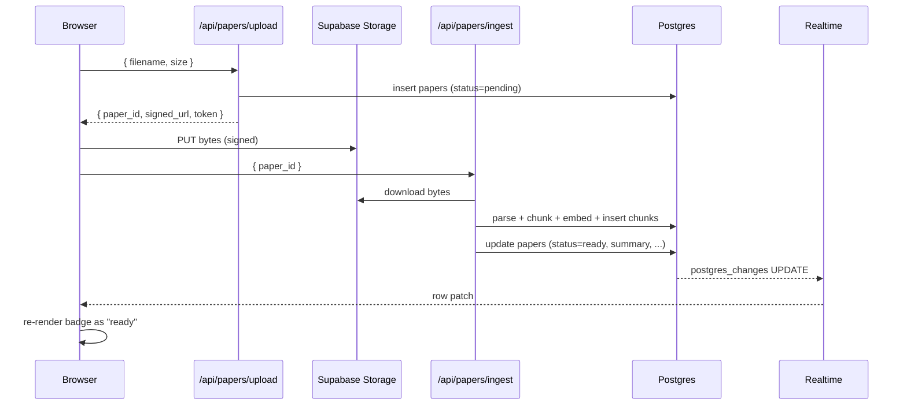

# Feature: Library

## Purpose

The library is the entry point for any research session. Users upload PDFs,
watch them ingest, filter by tag and free-text, and click into a paper
workspace.

## UX flow

1. Sign in -> middleware bounces unauthenticated traffic to `/login`.
2. Land on `/library` (the `/` redirect target).
3. Drop one or more PDFs onto the dropzone. Optimistic placeholder cards appear instantly.
4. Status badge animates `pending -> parsing -> embedding -> ready` driven by Supabase Realtime, no refresh.
5. Filter row: free-text input, plus tag pill rows grouped by category (Prosthetics / Orthotics / Robotics / Neurorehabilitation / Biomechanics / Sensors & Control / Clinical Context / Methods).
6. Click a card -> `/papers/[id]`. Click the chat-bubble icon on the card -> jumps straight to the chat tab.
7. Trash icon -> `confirm()` -> hard delete (cascades chunks + Storage object).

## Technical implementation

- Page: [`src/app/library/page.tsx`](../../src/app/library/page.tsx) - server fetches the initial list.
- Client island: [`src/app/library/_components/LibraryClient.tsx`](../../src/app/library/_components/LibraryClient.tsx) - owns Realtime sub, optimistic state, filter state.
- Upload: [`src/app/library/_components/UploadDropzone.tsx`](../../src/app/library/_components/UploadDropzone.tsx) calls `POST /api/papers/upload`, gets a signed-URL token, PUTs the bytes to Supabase Storage with `uploadToSignedUrl`, then triggers `POST /api/papers/ingest`.
- Card: [`src/app/library/_components/PaperCard.tsx`](../../src/app/library/_components/PaperCard.tsx) with status badge component dispatching on `status`.
- Tag filter: pill rows from `groupTagsByCategory()` + a separate muted "Other" row for legacy / unknown tags. Pretty labels via `labelFor()` so `afo` renders as `AFO`.
- Realtime subscription: `supabase.channel('papers-realtime').on('postgres_changes', ...)`. `papers` is added to the `supabase_realtime` publication in migration 0003.

## Data flow

## Future improvements

- Bulk upload with a progress strip across the top.
- Folder / collection support with drag-and-drop reorganisation.
- Multi-select bulk operations (delete, archive, move).
- Saved filters and pinned views.
- A thumbnail of the first page in each card.
