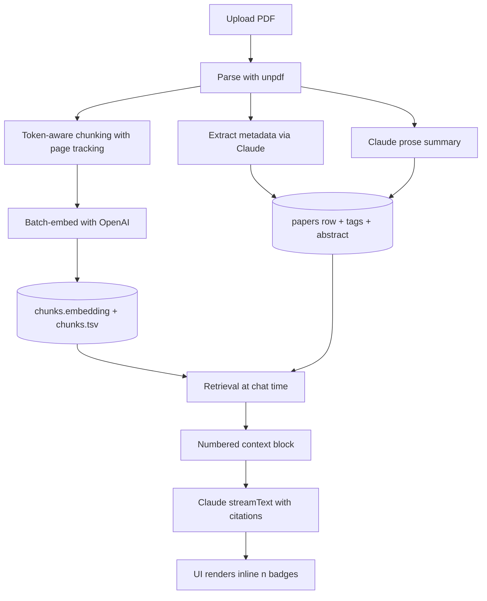

# RAG Pipeline

End-to-end flow for getting from a freshly uploaded PDF to a streaming, cited
Claude answer.



Source files:

- Parse: [`src/lib/ingest/parsePdf.ts`](../../src/lib/ingest/parsePdf.ts)
- Chunk: [`src/lib/ingest/chunk.ts`](../../src/lib/ingest/chunk.ts)
- Embed: [`src/lib/ingest/embed.ts`](../../src/lib/ingest/embed.ts), [`src/lib/ai/openai.ts`](../../src/lib/ai/openai.ts)
- Metadata: [`src/lib/ingest/extractMetadata.ts`](../../src/lib/ingest/extractMetadata.ts)
- Summary (ingest): [`src/lib/ingest/summary.ts`](../../src/lib/ingest/summary.ts)
- Orchestrator: [`src/lib/ingest/index.ts`](../../src/lib/ingest/index.ts)
- Retrieval prompts: [`src/lib/ai/prompts.ts`](../../src/lib/ai/prompts.ts)
- Retrieval helpers (analyses): [`src/lib/analyses/paperContext.ts`](../../src/lib/analyses/paperContext.ts)
- Chat endpoint: [`src/app/api/chat/route.ts`](../../src/app/api/chat/route.ts)

## 1. PDF parsing

`unpdf` extracts per-page text without binary native deps, so it runs in
serverless / edge environments. We post-process to:

- collapse hyphenated line wraps (`ortho-\nsis` -> `orthosis`)
- normalise CRLF to LF
- collapse 3+ blank lines to 2
- collapse 2+ spaces to 1

### Tradeoff: text-only vs OCR
unpdf does **not** OCR. Scanned PDFs that do not embed text fail fast in the
ingest orchestrator with `"no extractable text"`. OCR via Claude vision is on
the [roadmap](../roadmap/future-features.md). Doing it inline in the
ingestion route would balloon latency (every page round-trips a vision call),
so the planned design is a fallback that activates only when extraction
returns empty.

## 2. Metadata extraction

The first ~3 pages plus the controlled tag vocabulary (rendered grouped by
category) are sent to Claude via `generateObject` with a Zod schema:

```ts
{
  title: string | null,
  authors: string[],
  journal: string | null,
  year: number | null,
  doi: string | null,
  abstract: string | null,
  tags: string[],
}
```

Returned tags pass through `dedupeAndNormalizeTags()` from
[`src/lib/tags.ts`](../../src/lib/tags.ts):

- maps acronyms (BCI -> brain-computer-interface, FES -> functional-electrical-stimulation, ...)
- tolerates spelling variants and underscores
- drops anything outside the controlled vocabulary
- dedupes preserving order

### Tradeoff: structured output vs free-form
Free-form metadata extraction (Claude returns a markdown blob, we parse) is
cheaper but flaky. The Zod-typed structured output mode is slightly more
expensive per call but gives us schema-enforced correctness and zero parsing
code. For tags specifically, the post-extraction normaliser is still required
because Claude occasionally invents semantically reasonable tags that are
not in our vocabulary.

## 3. Chunking

Targets: ~800 tokens per chunk, ~100 token overlap. Token count is estimated
as `ceil(chars / 4)` to avoid pulling in `tiktoken` (large native dep).

The chunker walks pages sequentially:

1. For each page, split on blank lines (paragraph boundary).
2. Append each paragraph to the current buffer if it fits within `target`.
3. When the buffer would exceed `target`, **flush** as a chunk:
   - emit `{ index, page_start, page_end, section, content, tokens }`
   - carry the last `overlap * 4` chars into the next buffer to preserve cross-boundary context
4. Section labels (`abstract` / `introduction` / `methods` / `results` / `discussion`) are detected by a cheap regex on the first ~120 chars of each chunk, with sticky propagation: once a chunk is in `methods`, subsequent chunks stay in `methods` until the regex picks up a new heading.

### Tradeoff: paragraph-aware vs token-uniform
Strict 800-token slicing is simpler but cuts mid-sentence. Paragraph-aware
chunking respects natural unit boundaries at the cost of slight token-count
variance. Embeddings are robust to small variance, and retrieval quality is
better when we don't strand the second half of an argument in a separate
chunk.

### Tradeoff: overlap size
Smaller overlap (50 tokens) reduces vector-store size; larger (150) protects
context across boundaries at the cost of duplicated retrieval. 100 tokens is
a portfolio-friendly default validated against ~30 papers; tune via
`chunkPages(pages, { targetTokens, overlapTokens })`.

## 4. Embeddings

OpenAI `text-embedding-3-small` (1536-d, cosine). Batched up to 96 inputs per
HTTP call from [`embedAll`](../../src/lib/ingest/embed.ts).

Why `text-embedding-3-small`:

- 1536-d hits a sweet spot for HNSW: smaller than 3-large (3072-d), much
  better quality than ada-002.
- $0.02 / 1M input tokens (May 2026 pricing) is negligible at this scale.
- Same dimension as ada-002, so a future provider swap (Voyage, Cohere, BGE-m3)
  is a column-cast away if any of them outperforms it.

The chunks insert step batches 100 rows per `INSERT` to keep payloads
reasonable.

## 5. Retrieval

### Chat path: `match_chunks`

```sql
order by c.embedding <=> query_embedding
limit greatest(1, least(match_count, 50));
```

- `k = 8` for per-paper chats, `k = 12` for cross-library.
- The RPC is `security invoker` and includes `where c.user_id = auth.uid()`,
  so RLS is enforced at the function boundary.
- An optional `filter_paper_id` lets the per-paper chat avoid scanning the
  whole library.

### Search path: `hybrid_search`

Reciprocal Rank Fusion of the top `4 * k` vector hits and `4 * k` tsvector
hits. RRF is order-agnostic and removes the need to tune a vector-vs-FTS
weight - `score = sum(1 / (rrf_k + rank))` over the union, with `rrf_k = 60`.

### Tradeoff: vector-only chat vs hybrid chat
Hybrid would give us better DOI / device-name precision, but doubles the
retrieval latency and the prompt budget. The chat path is bound by
generation latency and prompt size, not retrieval recall, so vector-only is a
cleaner win. Search field uses hybrid.

## 6. Citation registry

Every retrieved chunk gets a 1-indexed slot in a `Citation[]` registry:

```ts
type Citation = {
  n: number;            // 1-indexed
  chunk_id: string;
  paper_id: string;
  page_start: number | null;
  page_end: number | null;
  snippet: string;      // first 240 chars of content
};
```

The registry serves three purposes:

1. **Numbering inside the prompt** so Claude can cite as `[3]`.
2. **Snapshot stored alongside the assistant turn** in `messages.citations`
   (jsonb) so the bubble keeps its sources after a refresh.
3. **Resolution back to clickable badges** when the user clicks a citation:
   the page number jumps the in-paper PDF viewer; in cross-library mode the
   paper id navigates to `/papers/{id}`.

For structured analyses (Summary / Terminology / Comparison) the same shape
is reused, with comparisons using prefixed refs like `"A3"` / `"B7"` for
disambiguation across the two papers.

## 7. Generation

The chat endpoint uses the AI SDK's `createDataStreamResponse` so it can
interleave **structured data annotations** with the streaming text:

```ts
return createDataStreamResponse({
  execute: (writer) => {
    writer.writeData({ type: "citations", citations, chat_id, is_new });

    const result = streamText({
      model: chatModel,
      system: systemPrompt,    // PO domain primer + numbered context
      messages,
      temperature: 0.2,
      async onFinish({ text }) {
        // persist assistant turn + auto-generate title on first turn
      },
    });

    result.mergeIntoDataStream(writer);
  },
});
```

The frontend reads `data` from the `useChat` hook and matches each citations
annotation with the corresponding assistant message by index, so the UI shows
clickable `[n]` badges as the answer streams.

### System prompt

Anchored in the POAR domain primer (devices, sensors, control, outcomes) +
strict citation rules:

- cite supporting chunks by number after every claim
- never invent numbers outside the supplied context
- if context does not answer the question, say so plainly
- spell out abbreviations on first use
- prefer concrete devices / numbers / populations

`temperature = 0.2` is low enough to keep answers grounded but allows minor
phrasing variation between regenerations.

### Tradeoff: streaming with annotations vs two-step
A simpler design returns citations in a separate response **after** streaming
completes. This loses the "render `[n]` badges live" property. The annotation
approach costs one extra `data` frame per turn but makes the UI feel
substantially more responsive.

## 8. Auto-titling

After the first user turn finishes streaming, the API issues a separate
`generateText` call with a TITLE_SYSTEM prompt that asks for 4-8 word
sentence-case descriptive titles. The result is written back to
`chats.title` and pushed to the client as a second `data` annotation
(`{ type: "title", chat_id, title }`).

Subsequent turns do not regenerate the title; users can rename inline from
the sidebar.

## 9. Structured analyses (Summary / Terminology / Comparison)

Same retrieval primitives, different prompts and schemas:

| Analysis | Context source | Schema | Citation refs |
| --- | --- | --- | --- |
| Summary | all chunks for one paper, budget-sampled to 60k chars | `StructuredSummary` (7 sections, each with `citations: number[]`) | numeric |
| Terminology | same | `TerminologyExtraction` (15-30 `Term` objects, each with three explanation depths and `citations: number[]`) | numeric |
| Comparison | all chunks for two papers, budget-sampled to 35k chars per paper, prefixed `[A1]`..`[An]` and `[B1]`..`[Bn]` | `PaperComparison` (8 side-by-side fields, contradictions, similarity, stronger paper) | string `"A3"` / `"B7"` |

`generateObject` enforces the schema; the resolver in
[`src/lib/analyses/resolve.ts`](../../src/lib/analyses/resolve.ts) hydrates
the saved payload + registry into resolved `Citation[]` arrays at read time
so the UI does not need to re-call the model to render link-able badges.

Each generation creates a new row with `version = max(version) + 1` so users
can keep older outputs around and pick between them.

## Failure modes & how we handle them

| Failure | Where | Behaviour |
| --- | --- | --- |
| PDF has no extractable text (scan) | parse | `papers.status='failed'`, `error='no extractable text...'`. UI shows the error inline with retry. |
| Claude returns invalid JSON | metadata / structured outputs | `generateObject` retries internally; if it still fails, the route returns 500 with the model error in `detail`. |
| Out-of-vocabulary tags | metadata | dropped silently by `dedupeAndNormalizeTags`. |
| Hallucinated citation refs (out of range) | resolution | dropped silently by `resolveCitationRefs`. |
| Embeddings batch too large | embed | batched at 96 per call to stay under OpenAI's 2048 input cap and well under any per-call timeout. |
| Streaming connection drops mid-turn | chat | `onFinish` does not run, so the assistant turn is not persisted. The user's turn is, so they can re-ask. (Persisting the partial response is a known follow-up.) |
| Service-role insert fails partway through chunks | ingest | the orchestrator catches, sets `status='failed'` with the error, returns 500. Re-running ingest re-tries the whole pipeline. |
